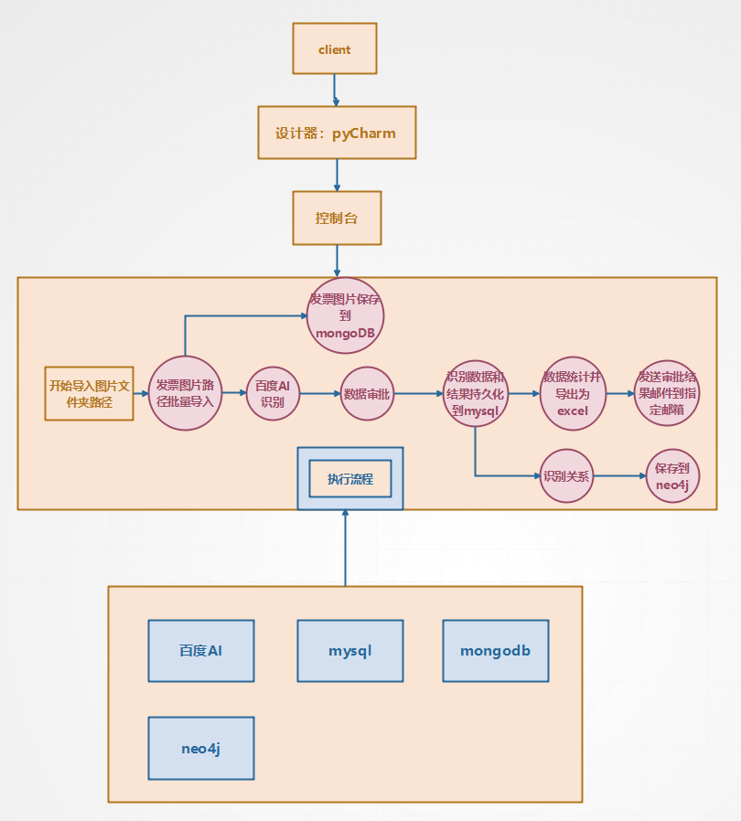

<!--
 * @Author: error: error: git config user.name & please set dead value or install git && error: git config user.email & please set dead value or install git & please set dead value or install git
 * @Date: 2023-04-10 13:09:58
 * @LastEditors: error: error: git config user.name & please set dead value or install git && error: git config user.email & please set dead value or install git & please set dead value or install git
 * @LastEditTime: 2023-04-10 14:47:14
 * @FilePath: \undefinedd:\2022-2023-2\pingtaisheji\gitRPA\recognizePic\README.md
 * @Description: 这是默认设置,请设置`customMade`, 打开koroFileHeader查看配置 进行设置: https://github.com/OBKoro1/koro1FileHeader/wiki/%E9%85%8D%E7%BD%AE
-->
# RPA
这是个基于百度AId的api的自动化发票流程处理项目
# 包含内容
包括发票信息提取，自动审批，识别交易主体，并将原始数据（发票图片）保存到mongoDB中，将交易信息保存到mysql中，
将交易关系保存在neo4j中，并会将信息统计并生成一个excel表格，统计审批情况，画图，统计审批的条目数量
# 项目结构
## 代码说明
具体的函数作用可以参考注释
```
├── assets:存放一些图片
├──ReconginzePicture.py:用于传入图片路径，转成base64然后调用百度的api进行识别
├── main.py 主函数
├── utils.py 工具函数
├── mongoDB.py 用于连接mongoDB,并将数据保存到mongoDB中
├── mysql.py 用于连接mysql,并将数据保存到mysql中
├── neo4j.py 用于连接neo4j,并将数据保存到neo4j中
├── clearAll.py 用于清空所有的数据
├── sendEmail.py 用于发送邮件
├── test.py 用于测试
├── store_with_excel.py 用于将数据存储到excel中,但是现在已经不用了，因为整合到了mysqlDao里了
├── config.py 用于配置一些参数,这里参数是写在我本地的，需要的可以换成自己的参数
```
## 架构图

# 环境
pycharm，python3.11
# 更迭历史
1.目前测试了小数量的发票识别，还有单一财务关系识别<br/>
2.测试过小数量的发票识别，多个财务关系识别<br/>
3.测试过大数量的发票识别，batch_size = 10<br/>
4.完成发邮件功能<br/>
# 测试
5.你好呀这里是测试
xgh:测试通过！现在你可以试试我push之后你那边的操作了~~
